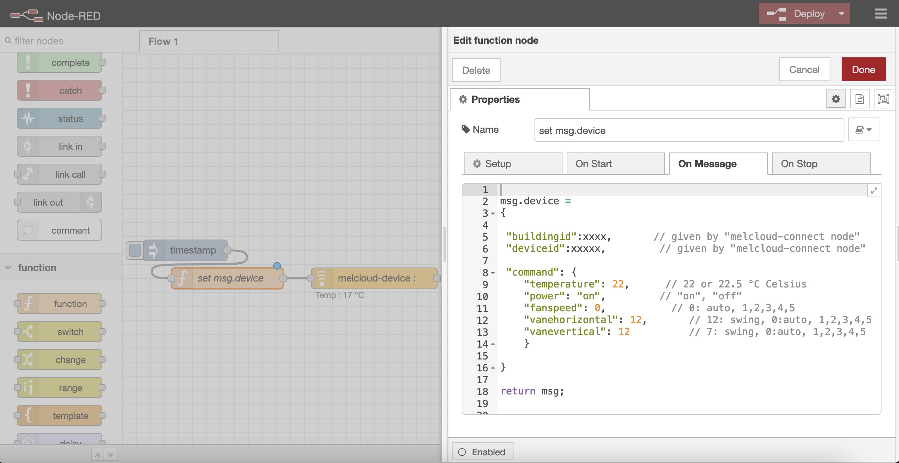

# node-red-contrib-melcloud-for-geodan

This is an atempt to adapt the node-red-contrib-melcloud created by ysimonx to work with the geodan heat pump.

node-red node for mitsubishi with melcloud API

Enter your credentials (email & password) from your Mitsubishi
melcloud account on https://app.melcloud.com/

First Node : melcloud-connect is provided in order to retrieve your
devices lists

Second Node : melcloud-device is provided in order to retrieve a
device informations (buildingid and deviceid are shown with
melcloud-connect)

All provided setting (switch on/off, temperature, fan speed, mode ...) will update your melcloud configuration 

You can also send input data with msg.device

possible mode's values are "auto", "heat", "dry", "fan", "cooling"
 
Full documentation on : https://www.npmjs.com/package/node-red-contrib-melcloud
or https://github.com/ysimonx/node-red-contrib-melcloud
